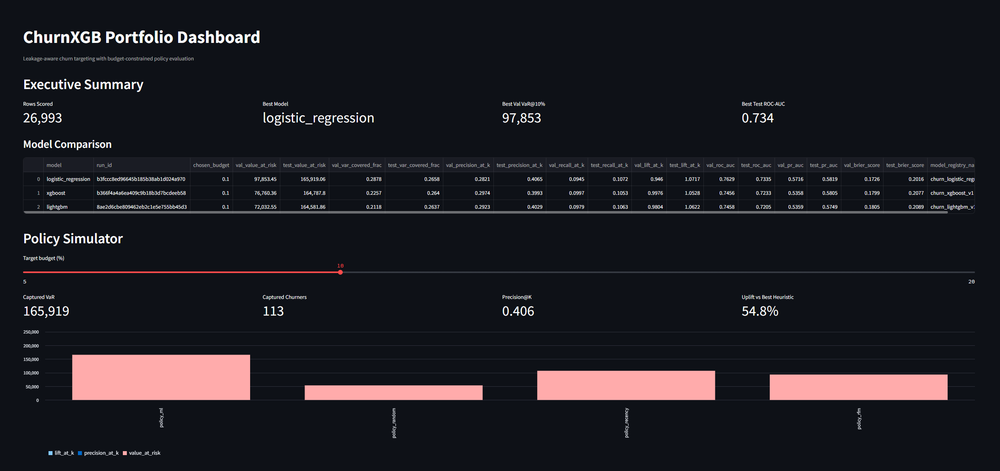
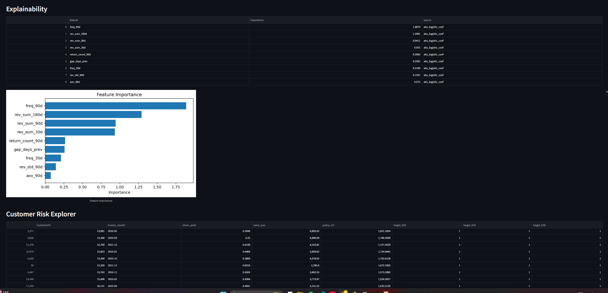

# ChurnXGB - Leakage-Aware Churn Targeting Under Budget Constraints

I built this project around a version of churn modeling that felt closer to a real retention workflow than the usual "predict churn probability" setup.

The question I used was:

If a team can only contact 5% to 20% of customers, who should they prioritize to protect the most value at risk?

That decision framing shaped most of the project:
- I built point-in-time customer-month snapshots so features only use information available at decision time.
- I defined churn operationally as no purchase in the next 90 days after the cutoff timestamp.
- I evaluated models not just with standard ML metrics, but also with Value-at-Risk@K and related top-K targeting metrics.
- I compared a more complex model family against simpler baselines and heuristic policies instead of assuming the most complex model would win.
- I added MLflow logging, drift outputs, a modular scoring layer, a small FastAPI service, and a lightweight Streamlit dashboard so the repo covers more than just training a model once in a notebook.

The repository now includes:
- point-in-time feature generation and 90-day churn labeling
- multi-model training across XGBoost, Logistic Regression, and LightGBM
- business-aware evaluation with Value-at-Risk@K plus broader ML metrics
- rolling temporal backtesting
- MLflow experiment logging and model promotion
- a clean inference contract that separates training-only columns from prediction-time inputs/outputs
- a reusable scoring module used by both offline scoring and the API layer
- a FastAPI inference service for batch-like request scoring
- interpretability artifacts
- PSI-based drift monitoring
- a Streamlit dashboard that loads saved artifacts
- a Dockerized API entrypoint for local containerized serving

## System Overview

At this point, the repo works like a small ML system rather than just a modeling script.

The offline side starts from raw transactions, cleans them, aggregates them to customer events, builds point-in-time customer-month snapshots, labels 90-day churn, and trains multiple models with temporal validation. Training logs runs to MLflow, saves model artifacts locally, and writes a lightweight promotion record for the selected model.

After that, the promoted model can be used in two ways. The scoring pipeline reads the saved feature table and writes scored outputs, target lists, and drift artifacts. The API uses the same scoring logic, but applies it to request data that matches the saved inference contract. The Streamlit dashboard stays artifact-driven and reads the saved outputs for review and demo purposes.

## Architecture / Data Flow

I think of the repo in six stages:

1. `data/raw` -> `src/churnxgb/data` / `src/churnxgb/features`
   Raw transaction lines are cleaned and converted into invoice, event, and customer-month tables.
2. `data/processed/customer_month_features.parquet`
   This is the core point-in-time modeling table used by both training and offline scoring.
3. `src/churnxgb/pipeline/train.py`
   Training does temporal splitting, model comparison, MLflow logging, promotion, backtesting, and reference drift profile creation.
4. `models/promoted/production.json` + `models/registry/...`
   These files define which model is currently promoted and what schema it expects at inference time.
5. `src/churnxgb/pipeline/score.py` and `src/churnxgb/api/app.py`
   Offline scoring and API inference both call the same modular scoring logic.
6. `outputs/` + `reports/` + `dashboard/app.py`
   Predictions, target lists, monitoring artifacts, and the dashboard all sit on top of saved outputs.

## Why I Framed The Problem This Way

Most churn projects stop at ranking by churn probability. I wanted this one to reflect the actual constraint a retention team faces: limited outreach capacity.

If a team can only intervene on a small share of customers, a model with a decent AUC is not automatically useful. What matters is whether the ranking surfaces customers who are both likely to churn and worth prioritizing.

That is why I used the policy:

`policy_ml = P(churn) * value_pos`

where `value_pos` is a pre-decision value proxy based on trailing 90-day revenue clipped at zero.

I chose that on purpose because I did not want to use future value information that would not exist at scoring time.

## Problem Framing

Each row is a customer-month snapshot. Let `T` be the customer's last purchase timestamp in that month.

- Features use data available up to `T`
- Labels use events strictly after `T`
- Churn is defined as no purchase in the next 90 days after `T`

I used this setup because it is much closer to how the model would be used in practice and because it helps avoid obvious leakage from future behavior.

## Dataset

- Source: Online Retail II transactional dataset
- Raw grain: transaction lines
- Current processed modeling table: 26,993 customer-month rows
- Current event table: 44,571 customer events
- Observed monthly span in processed data: `2009-12` through `2011-12`

I converted the raw transactions into a customer-month prediction problem because that gave me a reasonable decision grain for retention targeting while still preserving temporal ordering.

## Feature Engineering

I computed features at the customer-month cutoff using only prior customer behavior:

- trailing revenue sums: `rev_sum_30d`, `rev_sum_90d`, `rev_sum_180d`
- purchase frequency: `freq_30d`, `freq_90d`
- revenue volatility: `rev_std_90d`
- return behavior: `return_count_90d`
- average order value proxy: `aov_90d`
- recency gap: `gap_days_prev`

I kept the feature set fairly compact and interpretable instead of building a very wide table with weakly justified variables. I wanted the project to show solid point-in-time feature engineering without becoming hard to explain.

## Models I Compared

I did not want the project to rely on a single model family, so I compared:

- `xgboost`
- `logistic_regression`
- `lightgbm`

I also kept non-ML policy baselines because I wanted the learned models to earn their complexity:

- recency-based targeting
- RFM-style targeting
- random targeting baseline

Including logistic regression was important to me because it gives a simple baseline and helps answer whether the tree models are actually adding value or just adding complexity.

## Evaluation

I kept the original business-first framing and then expanded the evaluation so the repo shows both decision-focused metrics and standard ML metrics.

### Business / targeting metrics

- Value-at-Risk@K
- fraction of total value-at-risk captured
- Precision@K
- Recall@K
- Lift@K

### ML metrics

- ROC-AUC
- PR-AUC
- Brier score
- calibration curve data

### Saved plots

Generated in `reports/figures/`:
- ROC curve
- Precision-Recall curve
- lift curve
- calibration curve
- feature importance plot

VaR@K is still the main metric I would emphasize in a retention setting, but PR-AUC, Brier score, and calibration matter too if I want to show that the underlying probabilities are at least directionally sensible.

## Current Results

### Holdout comparison at 10% budget

| model | val_value_at_risk | test_value_at_risk | test_roc_auc | test_pr_auc | test_brier_score |
|:--|--:|--:|--:|--:|--:|
| logistic_regression | 97,853.45 | 165,919.06 | 0.7335 | 0.5819 | 0.2016 |
| xgboost | 76,760.36 | 164,787.80 | 0.7233 | 0.5805 | 0.2077 |
| lightgbm | 72,032.55 | 164,581.86 | 0.7205 | 0.5749 | 0.2089 |

Promoted model: `logistic_regression`

One thing I like about the result is that logistic regression won the current comparison. I think that makes the project stronger because it shows I let the validation metric choose the model instead of forcing the more complex option to be the headline result.

### Promoted model test targeting metrics

| budget_k | value_at_risk | var_covered_frac | precision_at_k | recall_at_k | lift_at_k |
|:--|--:|--:|--:|--:|--:|
| 5% | 108,496.47 | 0.1738 | 0.4604 | 0.0607 | 1.2140 |
| 10% | 165,919.06 | 0.2658 | 0.4065 | 0.1072 | 1.0717 |
| 20% | 260,599.82 | 0.4175 | 0.3939 | 0.2078 | 1.0385 |

At the 10% budget level, the promoted model captures `165,919.06` in value at risk on the holdout split. Compared with the best heuristic baseline at the same budget, that is roughly a `54.8%` uplift in captured value at risk.

### Temporal backtesting

I added rolling expanding-window backtesting because I did not want the whole project to rest on one train/validation/test split.

Backtesting was run across 9 chronological folds:

- `2010-06_2010-07`
- `2010-08_2010-09`
- `2010-10_2010-11`
- `2010-12_2011-01`
- `2011-02_2011-03`
- `2011-04_2011-05`
- `2011-06_2011-07`
- `2011-08_2011-09`
- `2011-10_2011-11`

Backtest outputs are written to:
- `reports/backtest_detail.csv`
- `reports/backtest_summary.csv`
- `reports/backtest_summary.md`

That gave me a better answer to the question, "Does this still work when the time window shifts?" which felt more credible than relying only on one holdout split.

## Interpretability And Monitoring

I also wanted the repo to show more than training and scoring, so I added:

- feature importance artifacts in `reports/feature_importance.csv`
- feature analysis writeup in `reports/feature_analysis.md`
- drift monitoring outputs in `reports/monitoring/`

Interpretability is intentionally lightweight here. I mainly wanted a simple way to inspect model behavior without turning the project into a full interpretability platform.

## Dashboard

I added a Streamlit dashboard in `dashboard/app.py` so the saved outputs can be explored without retraining anything.

The dashboard includes:
- executive summary
- policy simulator
- model performance charts
- explainability view
- customer risk explorer
- drift monitoring

I kept the dashboard artifact-driven on purpose. For a recruiter or reviewer, that is a much smoother demo than requiring a live retrain just to inspect results.

### Dashboard Preview

The first dashboard view highlights the executive summary, model comparison table, and budget-based policy simulator. I like it as a quick overview because it communicates the promoted model, the top-line metrics, and how the targeting policy behaves at a chosen budget.



The second dashboard view focuses on explainability and customer-level exploration. It shows the promoted model's feature importance, the ranked customer risk table, and the target flags used for downstream action lists.



## Repository Structure

```text
config/
  config.yaml

data/
  raw/
  interim/
  processed/

dashboard/
  app.py

models/
  registry/
  promoted/

outputs/
  predictions/
  targets/

reports/
  evaluation/
  figures/
  monitoring/
  *.md / *.csv summaries

src/churnxgb/
  data/
  features/
  labeling/
  baselines/
  modeling/
  policy/
  evaluation/
  monitoring/
  pipeline/
  split/
  utils/

tests/
```

## How To Run

### 1. Install dependencies

```powershell
pip install -r requirements.txt
```

### 2. Run the pipeline

```powershell
$env:PYTHONPATH = "$PWD\src"

python -m churnxgb.pipeline.build_features
python -m churnxgb.pipeline.train
python -m churnxgb.pipeline.score
```

Or use the Windows runbook:

```powershell
powershell -ExecutionPolicy Bypass -File .\run.ps1
```

### 3. Run tests

```powershell
pytest -q
```

### 4. Launch the dashboard

```powershell
streamlit run dashboard/app.py
```

The dashboard reads saved artifacts and does not retrain models live.

### 5. Launch the API locally

```powershell
$env:PYTHONPATH = "$PWD\src"
uvicorn churnxgb.api.app:app --host 0.0.0.0 --port 8000
```

Example health check:

```powershell
Invoke-WebRequest http://127.0.0.1:8000/health
```

Example prediction request:

```powershell
$body = @{
  rows = @(
    @{
      CustomerID = 12345
      invoice_month = "2011-10"
      T = "2011-10-31T00:00:00"
      rev_sum_30d = 120.0
      rev_sum_90d = 260.0
      rev_sum_180d = 410.0
      freq_30d = 2.0
      freq_90d = 5.0
      rev_std_90d = 45.0
      return_count_90d = 0.0
      aov_90d = 52.0
      gap_days_prev = 11.0
    }
  )
} | ConvertTo-Json -Depth 4

Invoke-RestMethod `
  -Uri http://127.0.0.1:8000/predict `
  -Method Post `
  -ContentType "application/json" `
  -Body $body
```

### 6. Run the API in Docker

Build the image:

```powershell
docker build -t churnxgb-api .
```

Run the container:

```powershell
docker run --rm -p 8000:8000 churnxgb-api
```

The API is exposed at `http://127.0.0.1:8000` with:
- `GET /health`
- `POST /predict`

The container includes the source code, config, and saved model registry artifacts needed to start the API locally. It is meant as a minimal serving setup, not a full deployment platform.

## Key Outputs

### Training and evaluation

- `reports/model_comparison.csv`
- `reports/model_comparison.md`
- `reports/model_eval_summary.md`
- `reports/backtest_summary.csv`
- `reports/backtest_summary.md`
- `reports/feature_importance.csv`
- `reports/feature_analysis.md`
- `reports/final_upgrade_summary.md`
- `reports/final_results_summary.md`
- `reports/evaluation/classification_metrics.csv`
- `reports/evaluation/policy_metrics_all_models.csv`

### Monitoring and scoring

- `reports/monitoring/reference_profile.json`
- `reports/monitoring/drift_latest.json`
- `outputs/predictions/predictions_all.parquet`
- `outputs/targets/targets_all_k05.parquet`
- `outputs/targets/targets_all_k10.parquet`
- `outputs/targets/targets_all_k20.parquet`

### Promotion and experiment tracking

- `models/promoted/production.json`
- `mlflow.db`
- `mlruns/`

## Reproducibility Notes

- The pipeline logs a SHA-256 hash of the processed feature table as `data_version`.
- Training logs metrics and artifacts to MLflow.
- The promoted model record points to the selected MLflow run id.
- Each saved model also carries an `inference_contract.json` file that defines the required inference input columns and the clean prediction output schema.
- `requirements.txt` captures the runtime dependencies used for the upgraded pipeline.

I also added tests for temporal splitting, leakage-safe feature selection, feature schema, and metric sanity because I wanted a few targeted safeguards without turning the project into a heavy software engineering exercise.

## Known Limitations

- Delayed-label performance tracking after future labels mature is not yet implemented.
- Monitoring is intentionally lightweight: feature PSI plus score distribution summary stats.
- The FastAPI service is intentionally minimal: no authentication, request logging, or deployment infrastructure is included yet.
- The Docker setup is meant for local/containerized serving only and has not been extended into cloud infrastructure code.
- The dashboard is designed for portfolio/demo use, not production serving.
- Environment compatibility could still be tightened further, especially around package version consistency.

## What I Would Improve Next

If I continued this project, the next improvements I would prioritize are:

- lightweight hyperparameter search using the temporal validation framework
- explicit probability calibration comparisons
- cohort-level error analysis
- delayed-label evaluation of scored cohorts
- slightly stronger dashboard storytelling and drift alert summaries

I think those would add the most value without making the repo much more complicated than it needs to be.
