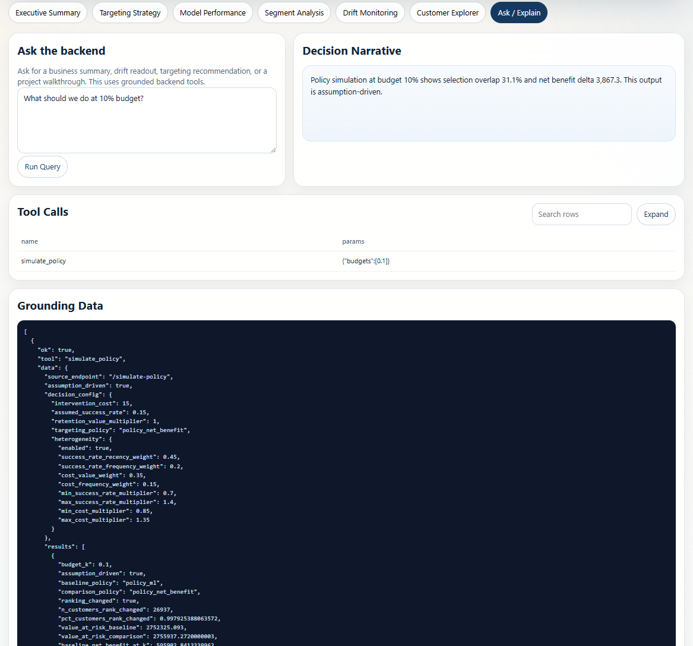
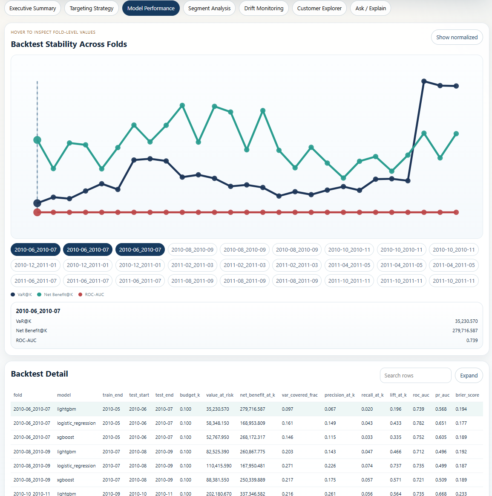
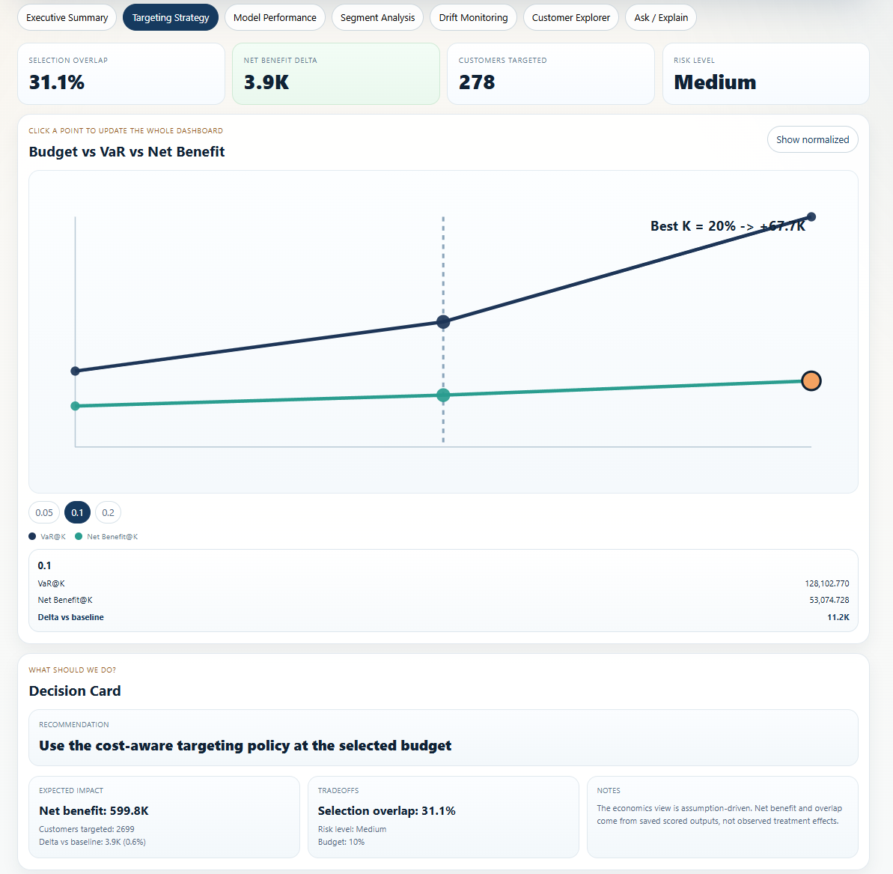
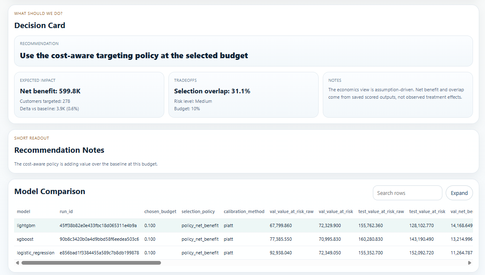
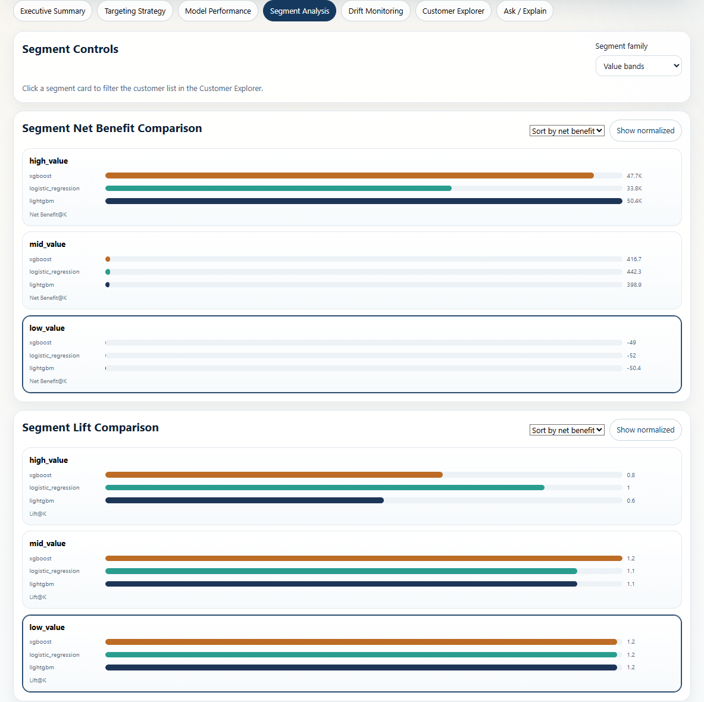
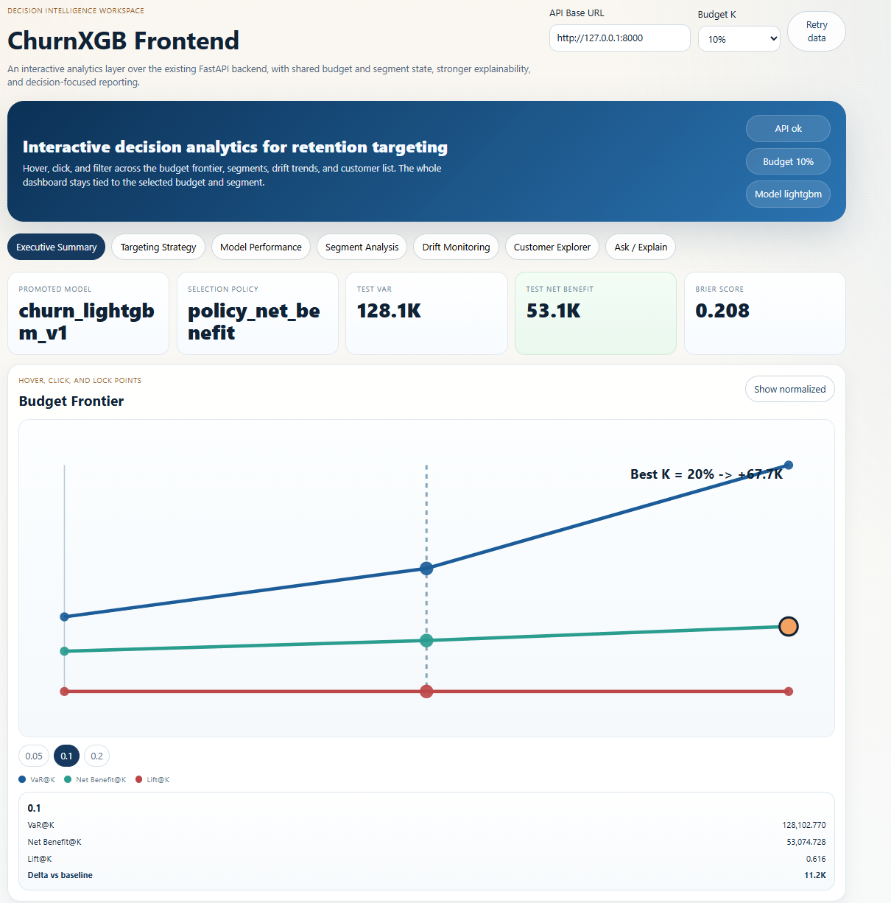

# ChurnXGB

ChurnXGB is a churn-targeting project built around one practical question:

If a business can only contact a small share of customers, who should it target to protect the most value?

So this repo is not just a churn classifier. It is an offline decision system built on customer-month snapshots, temporal validation, calibrated probabilities, budget-based targeting, and simple local serving through FastAPI and a React dashboard.

## What This Project Does

At a high level, the system:

- builds point-in-time customer-month features from transaction data
- predicts 90-day churn
- compares `xgboost`, `lightgbm`, and `logistic_regression`
- calibrates probabilities before deployment
- ranks customers with both `policy_ml` and `policy_net_benefit`
- evaluates results with standard metrics and decision metrics
- runs backtests and segment-level analysis
- tracks feature drift and decision drift
- serves saved outputs through FastAPI
- exposes results in Streamlit and React dashboards

The main idea is simple: a model with decent AUC is useful, but a targeting system is better if it can also show who to contact at 5%, 10%, or 20% budget and what the expected tradeoff looks like.

## Why This Is Different From A Basic Churn Demo

A lot of churn projects stop at:

"This customer has a high churn probability."

This repo goes further:

- which customers should be targeted at a fixed budget?
- how much value at risk sits inside the selected group?
- how does the answer change when intervention cost matters?
- does performance change across value bands and recency bands?
- does the decision system stay stable over time?

That makes it much closer to an applied data science project than a notebook-only model demo.

## Problem Setup

Each row is a customer-month snapshot.

For each row:

- features use only information available up to that month-end reference point
- labels are based on future behavior after that point
- churn means no purchase in the next 90 days

The project keeps the data grain fixed at customer-month. It does not switch to online event scoring or a different architecture.

## Repository Shape

The repo follows a simple production-style structure:

1. Offline pipeline
   - feature build
   - train and compare models
   - calibration
   - score the saved feature table
   - write reports and artifacts

2. FastAPI layer
   - prediction and explanation endpoints
   - budget frontier, segment, and drift endpoints
   - policy simulation endpoints over saved outputs

3. Frontends
   - Streamlit for artifact review
   - React for a more interactive decision dashboard

## Data And Features

Dataset:

- source: Online Retail II
- raw grain: transaction lines
- modeling grain: customer-month
- latest verified processed table size: `26,993` rows

Core feature families:

- revenue windows: `rev_sum_30d`, `rev_sum_90d`, `rev_sum_180d`
- frequency windows: `freq_30d`, `freq_90d`
- volatility: `rev_std_90d`
- returns: `return_count_90d`
- average order value proxy: `aov_90d`
- recency: `gap_days_prev`

The feature set is intentionally compact and interpretable.

## Models And Decision Scores

The training pipeline compares:

- `xgboost`
- `lightgbm`
- `logistic_regression`

It also keeps simple heuristic baselines for comparison.

The main decision scores are:

- `policy_ml = churn_prob * value_pos`
- `policy_net_benefit = expected_retained_value - expected_cost`

`policy_ml` is useful when you mainly care about risk times value.

`policy_net_benefit` is useful when you want a cost-aware ranking under a targeting budget.

## Calibration

This repo now calibrates probabilities before deployment.

That matters because this system uses predicted probabilities inside downstream ranking and policy calculations. If the probabilities are poorly calibrated, the decision layer gets noisier even if the rank ordering looks okay.

From the latest verified run:

- promoted model: `lightgbm`
- promoted artifact: `churn_lightgbm_v1`
- calibration method: `platt`
- chosen budget: `10%`
- selection policy: `policy_net_benefit`

Calibration improved the decision layer in the latest run:

- validation net benefit improved from about `14.2k` raw to `37.3k`
- test net benefit improved from about `21.7k` raw to `53.1k`
- validation Brier score improved from `0.1832` to `0.1818`
- test Brier score improved from `0.2170` to `0.2077`

That does not mean calibration improves every metric in every setting. It just means it helped the deployed decision setup here, which is exactly why it was worth adding.

## Latest Verified Results

These numbers come from a full pipeline run completed in this repo.

### Best model at the selected budget

- model: `lightgbm`
- run id: `45ff38b82e0e433fbc18d065311e4b9a`
- budget: `10%`
- selection policy: `policy_net_benefit`

### Holdout comparison at 10% budget

| model | val_net_benefit_at_k | test_net_benefit_at_k | test_value_at_risk | test_roc_auc | test_brier_score |
|:--|--:|--:|--:|--:|--:|
| lightgbm | 37,265.96 | 53,074.73 | 128,102.77 | 0.7167 | 0.2077 |
| logistic_regression | 32,486.32 | 38,294.51 | 152,092.72 | 0.7338 | 0.2016 |
| xgboost | 34,896.93 | 50,224.41 | 143,190.49 | 0.7224 | 0.2064 |

This is a good example of why the project uses more than one metric:

- logistic regression is still very competitive on standard classification metrics
- lightgbm wins on the selected decision objective in the verified run

### Budget frontier for the promoted model

| budget_k | value_at_risk | net_benefit_at_k | targeted_count | precision_at_k | recall_at_k | lift_at_k |
|:--|--:|--:|--:|--:|--:|--:|
| 5% | 77,688.30 | 41,899.80 | 139 | 0.2014 | 0.0266 | 0.5311 |
| 10% | 128,102.77 | 53,074.73 | 278 | 0.2338 | 0.0617 | 0.6165 |
| 20% | 235,673.05 | 67,672.40 | 556 | 0.2824 | 0.1490 | 0.7445 |

This frontier is not flat, which is a good sign. The tradeoff between budget, value captured, and net benefit is visible and meaningful.

## Segment Analysis

The project writes segment-level evaluation using existing behavioral features:

- value bands from `rev_sum_90d`
- recency buckets from `gap_days_prev`
- frequency buckets from `freq_90d`

Verified output:

- `.runtime/reports/evaluation_segments.csv`
- `27` segment rows in the latest run

What the latest run shows:

- high-value segments carry most of the business value
- mid-value segments can still contribute positive net benefit
- low-value segments can show decent lift but weak or negative economics

That is useful because it separates "the model can find churn" from "the action is worth paying for."

## Backtesting

The repo also runs expanding-window backtests instead of relying only on one split.

Saved outputs:

- `.runtime/reports/backtest_detail.csv`
- `.runtime/reports/backtest_summary.csv`

Why this matters:

- it checks whether the model and policy are reasonably stable over time
- it gives a better picture than a single holdout window

## Monitoring

There are two monitoring layers:

1. Feature drift
   - PSI by feature
   - drift summary and alert counts

2. Decision drift
   - selected share by month
   - average churn score in top-K
   - average value in top-K
   - monthly VaR@K trend

Saved outputs:

- `.runtime/reports/monitoring/drift_latest.json`
- `.runtime/reports/monitoring/drift_history.csv`
- `.runtime/reports/decision_drift.csv`

From the latest verified run:

- feature drift status was `ok`
- latest top PSI was `0.082`
- decision drift had `75` monthly budget rows

## API

The FastAPI backend serves both live scoring and saved decision artifacts.

Main endpoints:

- `GET /health`
- `GET /model-summary`
- `GET /model-comparison`
- `GET /policy-metrics`
- `GET /frontier`
- `GET /segments`
- `GET /backtest`
- `GET /targets/{budget_pct}`
- `GET /predictions`
- `GET /customers/explain`
- `GET /drift/latest`
- `GET /drift/history`
- `GET /drift/decision`
- `POST /predict`
- `POST /explain`
- `POST /simulate-policy`
- `POST /simulate-experiment`
- `POST /llm/query`
- `POST /llm/explain_customer`

The last two endpoints are optional helper layers on top of existing backend outputs. They do not replace the model or invent predictions.

## Dashboard Screenshots

### Executive Summary



### Targeting Strategy



### Model Performance



### Segment Analysis



### Decision Card And Model Comparison



### Ask / Explain



## How To Run

### 1. Install dependencies

```powershell
pip install -r requirements.txt
```

### 2. Set `PYTHONPATH`

```powershell
$env:PYTHONPATH = "$PWD\src"
```

### 3. Build features

```powershell
python -m churnxgb.pipeline.build_features
```

Builds the customer-month feature table from the raw retail data.

### 4. Train models

```powershell
python -m churnxgb.pipeline.train
```

Trains candidate models, calibrates probabilities, writes reports, and promotes the selected model.

### 5. Score the saved feature table

```powershell
python -m churnxgb.pipeline.score
```

Scores the saved table, writes predictions and target lists, and updates drift outputs.

### 6. Run tests

```powershell
pytest -q
```

### 7. Start the API

```powershell
uvicorn churnxgb.api.app:app --host 0.0.0.0 --port 8000
```

### 8. Start Streamlit

```powershell
streamlit run dashboard/app.py
```

### 9. Start the React frontend

```powershell
cd frontend
cmd /c npm.cmd install
cmd /c npm.cmd run dev
```

Optional build check:

```powershell
cd frontend
cmd /c npm.cmd run build
```

## Key Runtime Outputs

Model and evaluation:

- `.runtime/reports/model_comparison.csv`
- `.runtime/reports/training_manifest.json`
- `.runtime/reports/calibration_summary.md`
- `.runtime/reports/evaluation_segments.csv`
- `.runtime/reports/evaluation/lightgbm_test_frontier.csv`
- `.runtime/reports/backtest_detail.csv`
- `.runtime/reports/backtest_summary.csv`

Monitoring:

- `.runtime/reports/monitoring/drift_latest.json`
- `.runtime/reports/monitoring/drift_history.csv`
- `.runtime/reports/decision_drift.csv`

Scoring outputs:

- `.runtime/outputs/predictions/predictions_all.parquet`
- `.runtime/outputs/targets/targets_all_k05.parquet`
- `.runtime/outputs/targets/targets_all_k10.parquet`
- `.runtime/outputs/targets/targets_all_k20.parquet`

## Limitations

- policy simulation is assumption-driven, not causal inference
- experiment simulation is also assumption-driven
- delayed-label production monitoring is not implemented
- the API is local/dev oriented, not deployment infrastructure
- segment logic is intentionally simple

## Verdict

Yes, this is good enough for a strong data science graduate student portfolio project.

Why:

- the setup is realistic: leakage-aware snapshots, temporal splits, calibration, and budget-based targeting
- the evaluation is broader than just AUC
- the repo includes API serving, saved artifacts, monitoring, and a usable frontend
- the results are solid but believable, which is a good thing

The numbers are good, not magical:

- ROC-AUC is in a reasonable range around `0.72` to `0.73`
- calibration improved Brier score and decision value
- the budget frontier shows clear tradeoffs
- segment analysis and backtests add credibility

So my honest read is:

- for a grad student: yes, this is a strong project
- for internships or entry-level DS roles: definitely good enough
- for senior applied ML roles: probably not enough by itself, but a very good base

The biggest strength is not just the model result. It is that the project shows end-to-end thinking: data setup, leakage control, model comparison, decision metrics, monitoring, and a simple product layer on top.
