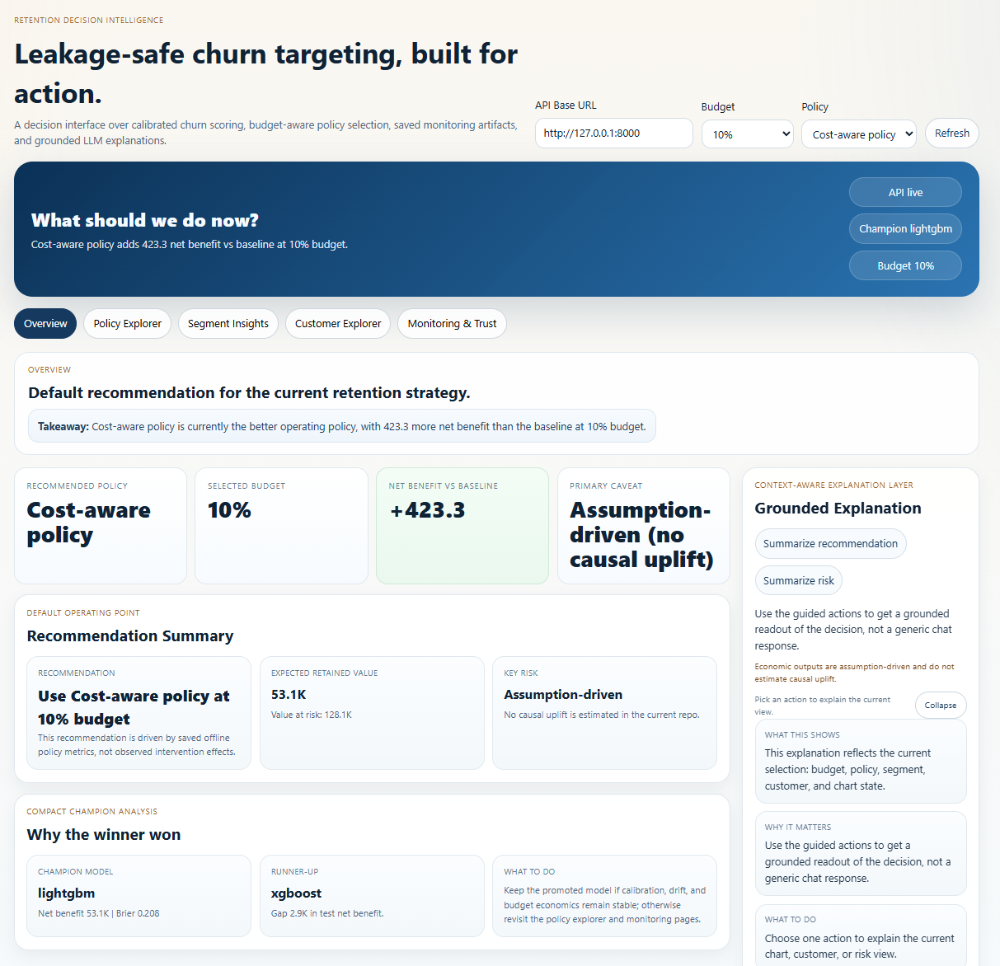
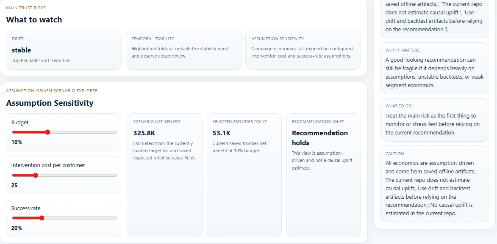
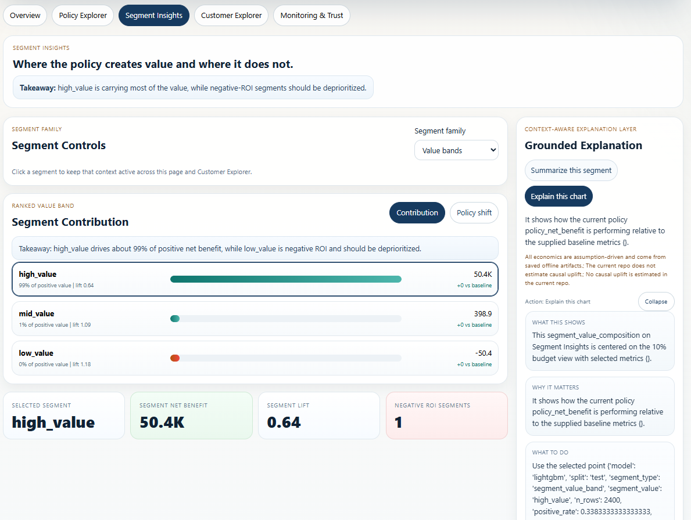
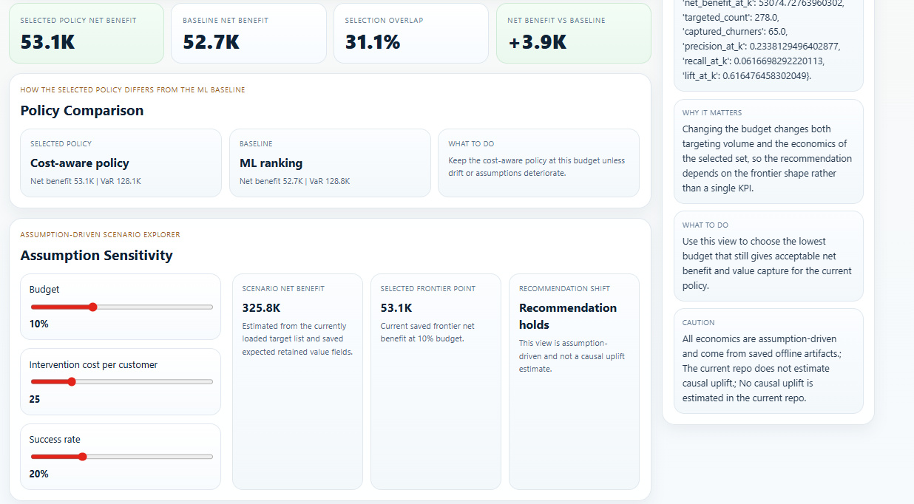
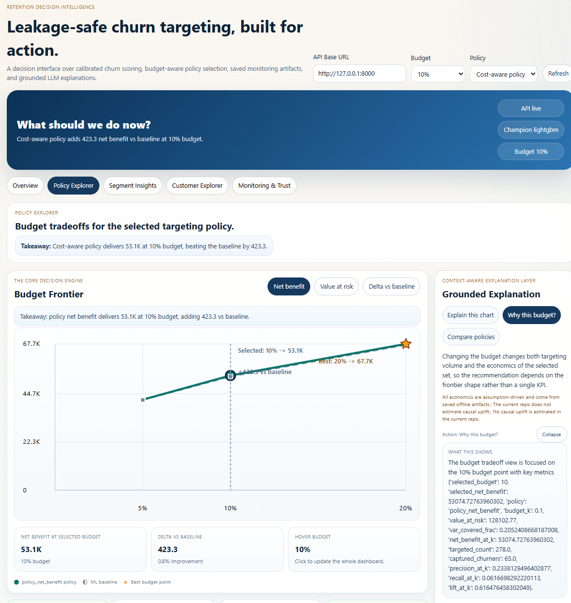
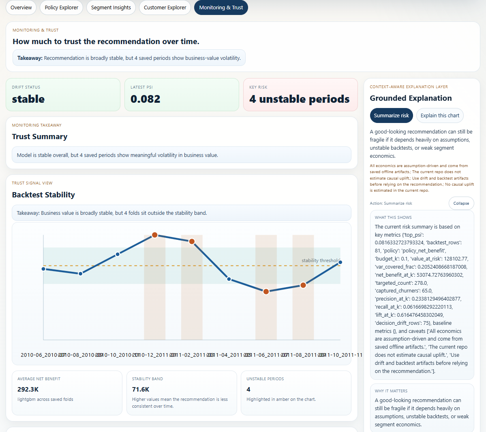

# ChurnXGB

ChurnXGB is a leakage-safe churn targeting system for retention decisions.

The core question is simple:

If the business can only contact a limited share of customers, who should it target to protect the most value?

That framing matters because this project is not just a churn classifier. It is a small decision intelligence system built around:

- point-in-time customer-month features
- calibrated churn probabilities
- budget-aware targeting policies
- saved offline evaluation artifacts
- monitoring and backtesting
- a React decision dashboard with grounded LLM explanations

All generated artifacts in the active workflow are written under `.runtime/`. The repo root is reserved for source code, configuration, raw data, and documentation.

## What The System Does

The pipeline:

1. builds customer-month snapshots from transaction data
2. creates leakage-safe 90-day churn labels
3. compares `xgboost`, `lightgbm`, and `logistic_regression`
4. calibrates probabilities before promotion
5. scores customers with both `policy_ml` and `policy_net_benefit`
6. evaluates ranking quality and decision quality
7. writes backtests, segment outputs, drift artifacts, predictions, and target lists
8. serves saved outputs through FastAPI
9. exposes them through a React dashboard designed around decisions, not raw metrics

## Why It Is Structured This Way

A few design choices are deliberate:

- The grain stays at `customer-month` because that is detailed enough to capture behavior shifts over time, while still producing a dataset that is easy to train, validate, score, and explain.
- The project treats leakage as a first-class risk. Features only use information available at the snapshot date, and labels are built strictly after that point.
- Calibration is included because the model output is used inside downstream policy logic, not just for leaderboard metrics.
- The decision layer is explicit. `policy_ml` captures a clean risk-times-value ranking, while `policy_net_benefit` is closer to how a real retention team would think about cost and expected retained value.
- The UI reads from saved artifacts rather than recomputing everything on demand. That keeps the workflow inspectable and easier to reason about.

## Problem Setup

Each row is a customer-month snapshot.

For each row:

- features only use information available up to that month-end reference point
- labels use behavior strictly after that point
- churn means no purchase in the next 90 days

This point-in-time setup is the backbone of the repo. A churn model can look much better than it really is if leakage slips in through features, labels, or time splits, so the whole pipeline is built to avoid that.

## Data And Features

Dataset:

- source: Online Retail II
- raw grain: transaction lines
- modeling grain: customer-month
- latest verified processed size: `26,993` rows

Feature families:

- revenue windows: `rev_sum_30d`, `rev_sum_90d`, `rev_sum_180d`
- frequency windows: `freq_30d`, `freq_90d`
- volatility: `rev_std_90d`
- returns: `return_count_90d`
- value proxy: `aov_90d`, `value_pos`
- recency: `gap_days_prev`

The feature set is intentionally compact. The goal is not to show off feature volume. The goal is to keep the model understandable while still making the targeting layer useful.

## Models, Policies, And Calibration

Models compared:

- `xgboost`
- `lightgbm`
- `logistic_regression`

Decision scores:

- `policy_ml = churn_prob * value_pos`
- `policy_net_benefit = expected_retained_value - expected_cost`

Why both exist:

- `policy_ml` is the cleaner analytical ranking score
- `policy_net_benefit` is the business-facing score because it tries to reflect expected retained value after intervention cost

Calibration is included because probability quality matters when probabilities feed policy. In the latest verified run:

- promoted model: `lightgbm`
- promoted artifact: `churn_lightgbm_v1`
- calibration method: `platt`
- selected budget: `10%`
- selected policy: `policy_net_benefit`

## Latest Verified Results

### Best model at the selected budget

- model: `lightgbm`
- run id: `45ff38b82e0e433fbc18d065311e4b9a`
- budget: `10%`
- selection policy: `policy_net_benefit`

### Holdout comparison at 10% budget

| model | val_net_benefit_at_k | test_net_benefit_at_k | test_value_at_risk | test_roc_auc | test_brier_score |
|:--|--:|--:|--:|--:|--:|
| lightgbm | 37,265.96 | 53,074.73 | 128,102.77 | 0.7167 | 0.2077 |
| logistic_regression | 32,486.32 | 38,294.51 | 152,092.72 | 0.7338 | 0.2016 |
| xgboost | 34,896.93 | 50,224.41 | 143,190.49 | 0.7224 | 0.2064 |

Why this matters:

- logistic regression stays competitive on standard classification metrics
- lightgbm wins on the selected decision objective
- this is exactly why the repo does not stop at ROC-AUC

### Budget frontier for the promoted model

| budget_k | value_at_risk | net_benefit_at_k | targeted_count | precision_at_k | recall_at_k | lift_at_k |
|:--|--:|--:|--:|--:|--:|--:|
| 5% | 77,688.30 | 41,899.80 | 139 | 0.2014 | 0.0266 | 0.5311 |
| 10% | 128,102.77 | 53,074.73 | 278 | 0.2338 | 0.0617 | 0.6165 |
| 20% | 235,673.05 | 67,672.40 | 556 | 0.2824 | 0.1490 | 0.7445 |

The frontier is one of the most useful outputs in the repo because it turns a modeling result into an operating decision.

## Segment Analysis, Backtesting, And Monitoring

Segment outputs:

- `.runtime/reports/evaluation_segments.csv`

Backtest outputs:

- `.runtime/reports/backtest_detail.csv`
- `.runtime/reports/backtest_summary.csv`

Monitoring outputs:

- `.runtime/reports/monitoring/drift_latest.json`
- `.runtime/reports/monitoring/drift_history.csv`
- `.runtime/reports/decision_drift.csv`

Why these were kept:

- Segment analysis helps separate lift from economic usefulness.
- Backtesting makes the result more believable than a single good holdout.
- Monitoring goes beyond feature drift and also checks how the selected population changes over time.

From the latest verified run:

- feature drift status: `ok`
- latest top PSI: `0.082`
- decision drift rows: `75`

## API

The FastAPI layer serves both live scoring and saved decision artifacts.

Main endpoint groups:

- summary
  - `GET /health`
  - `GET /model-summary`
  - `GET /model-comparison`
  - `GET /feature-importance`
- policy
  - `GET /policy-metrics`
  - `GET /frontier`
  - `GET /segments`
  - `POST /simulate-policy`
  - `POST /simulate-experiment`
- customers
  - `GET /targets/{budget_pct}`
  - `GET /predictions`
  - `GET /customers/explain`
  - `POST /predict`
  - `POST /explain`
- monitoring
  - `GET /drift/latest`
  - `GET /drift/history`
  - `GET /drift/decision`
  - `GET /backtest`
- grounded LLM explanations
  - `POST /llm/explain/chart`
  - `POST /llm/explain/customer`
  - `POST /llm/explain/segment`
  - `POST /llm/explain/policy`
  - `POST /llm/explain/budget-tradeoff`
  - `POST /llm/summarize/recommendation`
  - `POST /llm/summarize/risk`

The LLM layer is intentionally narrow. It is not presented as a generic chatbot. It is a structured explanation layer over saved dashboard context.

## Dashboard Walkthrough

The React dashboard is organized into five pages:

### 1. Overview

What it is for:

- quick recommendation
- selected budget and policy
- net benefit vs baseline
- the main caveat
- short grounded explanation

Why this matters:

This page is designed to answer the first recruiter or stakeholder question in a few seconds: what is the recommended operating point, and what is the catch?



What the main sections mean:

- the dark hero banner gives the current recommendation in plain language
- the top KPI row summarizes the operating point
- `Recommendation Summary` explains what to do and why
- `Why the winner won` explains why the promoted model was chosen
- the right-side explanation panel turns the current view into a short grounded narrative

### 2. Policy Explorer

What it is for:

- budget tradeoffs
- baseline vs selected policy
- net benefit vs value at risk
- assumption sensitivity

Why this matters:

This is the core decision page. It shows whether the business should keep the current budget, lower it, or spend more.

Full page:



Detail view:



What the main sections mean:

- `Budget Frontier` is the core decision engine
  - selected point = current budget
  - star = best budget by saved net benefit
  - baseline markers = `policy_ml`
  - toggle = switch between net benefit, value at risk, and delta vs baseline
- `Policy Comparison` explains how the selected policy differs from the ML baseline
- `Assumption Sensitivity` shows how the recommendation changes as cost and success-rate assumptions move
- the right-side explanation panel gives chart-specific or budget-specific grounded summaries

### 3. Segment Insights

What it is for:

- identify where value is concentrated
- spot negative-ROI segments
- compare policy impact by segment

Why this matters:

Average performance can hide weak economics in parts of the portfolio. This page shows where the model is actually useful.



What the main sections mean:

- `Segment family` switches between value, recency, and frequency segment definitions
- `Segment Contribution` ranks segments by saved contribution to value
- the `Policy shift` toggle shows baseline vs selected policy by segment
- the KPI row below gives a quick readout for the selected segment
- the explanation panel turns a chosen segment into a short business summary

### 4. Customer Explorer

What it is for:

- inspect an individual decision
- see risk, value, rank, and feature drivers
- explain why a customer was targeted

Why this matters:

This page makes the decision layer tangible. It moves from “the policy works on average” to “here is why this specific customer is in the target list.”

The customer page is not shown in the screenshots above, but the main sections are:

- customer selector filtered by budget and segment
- `Customer Decision Card`
- positive and negative feature drivers
- short grounded explanation for the selected customer

Important note:

This page depends on saved scored predictions. If it is empty, run:

```powershell
$env:PYTHONPATH="src"
python -m churnxgb.pipeline.score
```

### 5. Monitoring & Trust

What it is for:

- judge whether the recommendation is stable
- inspect drift
- inspect backtest stability
- stress-test assumption sensitivity

Why this matters:

A good-looking recommendation is not enough if it depends on unstable periods or fragile assumptions.

Full page:



Detail view:



What the main sections mean:

- the top takeaway tells whether the recommendation looks broadly stable
- the KPI row keeps only the main trust signals: drift, PSI, and key risk
- `Backtest Stability` highlights saved periods with unstable business value
- `What to watch` summarizes the main operational risks
- `Assumption Sensitivity` reminds the reader that the economics are scenario-based, not causal uplift estimates

## Repository Structure

- `src/churnxgb/data/`: raw loading and cleaning
- `src/churnxgb/features/`: customer-month feature construction
- `src/churnxgb/labeling/`: churn labels
- `src/churnxgb/split/`: temporal split logic
- `src/churnxgb/modeling/`: training, calibration, promotion, interpretability
- `src/churnxgb/policy/`: scoring and decision logic
- `src/churnxgb/evaluation/`: metrics, reports, backtests
- `src/churnxgb/monitoring/`: drift reference and reporting
- `src/churnxgb/inference/`: prediction contracts
- `src/churnxgb/pipeline/`: offline entrypoints
- `src/churnxgb/api/`: FastAPI app and routers
- `frontend/`: React decision dashboard
- `dashboard/`: legacy Streamlit artifact viewer
- `.runtime/`: generated models, reports, predictions, and monitoring outputs

## How To Run

### Full workflow from scratch

```powershell
pip install -r requirements.txt
cd frontend
npm install
cd ..
$env:PYTHONPATH="src"
python -m churnxgb.pipeline.build_features
python -m churnxgb.pipeline.train
python -m churnxgb.pipeline.score
uvicorn churnxgb.api.app:app --host 0.0.0.0 --port 8000
```

In a second terminal:

```powershell
cd frontend
npm run dev
```

Optional checks:

```powershell
pytest -q
cd frontend
cmd /c npm.cmd run build
```

There is also a root-level [commands.txt](./commands.txt) with the same run order.

## Key Runtime Outputs

Model and evaluation:

- `.runtime/reports/model_comparison.csv`
- `.runtime/reports/training_manifest.json`
- `.runtime/reports/calibration_summary.md`
- `.runtime/reports/evaluation_segments.csv`
- `.runtime/reports/evaluation/lightgbm_test_frontier.csv`
- `.runtime/reports/backtest_detail.csv`
- `.runtime/reports/backtest_summary.csv`

Monitoring:

- `.runtime/reports/monitoring/drift_latest.json`
- `.runtime/reports/monitoring/drift_history.csv`
- `.runtime/reports/decision_drift.csv`

Scoring outputs:

- `.runtime/outputs/predictions/predictions_all.parquet`
- `.runtime/outputs/targets/targets_all_k05.parquet`
- `.runtime/outputs/targets/targets_all_k10.parquet`
- `.runtime/outputs/targets/targets_all_k20.parquet`

## Limitations

- policy simulation is assumption-driven, not causal inference
- experiment simulation is also assumption-driven
- delayed-label production monitoring is NOT SUPPORTED BY CURRENT REPO
- the API is local/dev oriented, not deployment infrastructure
- segment logic is intentionally simple
